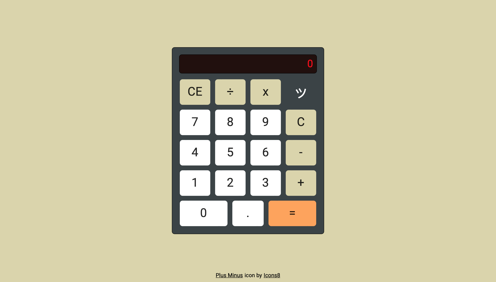

# Calculator

My implementation of the Calculator project for The Odin Project. Try it [here](https://jooo-lee.github.io/calculator/)!

## Description:

The user is able to calculate simple arithmetic operations involving adding, subtracting, multiplying and dividing. 

## Features:

* Clear all operations button
* Backspace / delete button
* Displays whole operation including operator
* Prevents crash when user divides by 0
* Subtract button can be used to negate
* Keyboard support

## Keyboard:

|  Keyboard  | Corresponding Button(s) |
| :--------: | :---------------------: |
|    0-9     |           0-9           |
|     +      |            +            |
|     -      |            -            |
|   x or *   |            x            |
|     /      |            ÷            |
|     .      |            .            |
| Enter or = |            =            |
|     c      |            C            |
|   Delete   |           CE            |

## I learned how to:

* Design for mobile first
* Use grid-column-start / grid-column-end to place grid items 
* Allow buttons to be clicked using the keyboard 
* Push to array and pop from array
* Slice array elements
* Use indexOf() to check if given element is present in string
* Replace characters in string using replace()
* Parse numerical value from string using Number()
* Truncate string using toFixed()